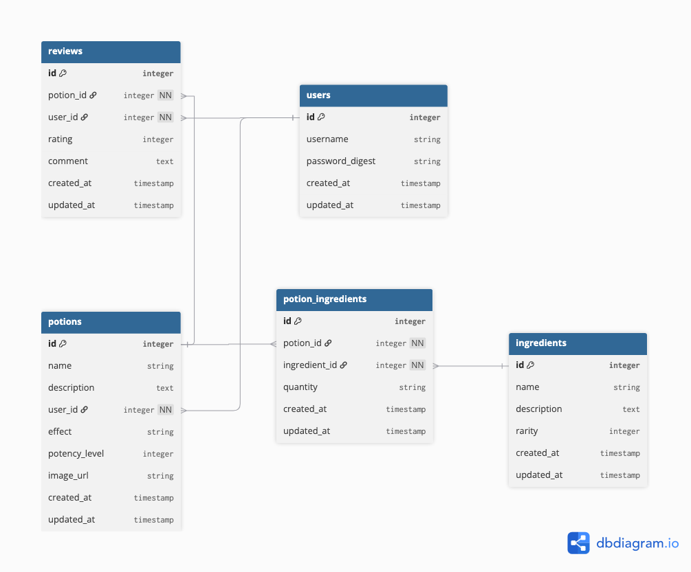

# Potion Crafter

Welcome to Potion Crafter, where code meets cauldrons and every user is a witch, wizard, or magical mischief-maker! ✨

Step into a bubbling online apothecary and brew up your own legendary potions. Mix rare ingredients, share your secret recipes, and rate the concoctions of fellow potion crafters. Whether you’re a seasoned sorcerer or a curious apprentice, this Rails-powered adventure lets you:

- Create, edit, and review magical potions
- Gather and combine mystical ingredients
- Leave enchanted feedback for other brewers
- Sort, filter, and discover the most potent elixirs
- Unlock achievements and seasonal surprises

Potion Crafter is more than just a web app—it’s a community for anyone who believes a little magic (and a lot of Ruby) can change the world. Grab your wand, sign up, and start brewing!

## User Stories

See [`user-stories.md`](./user-stories.md) for a full list of user stories and planned features.

## Entity Relationship Diagram (ERD)

[ERD Source](https://dbdiagram.io/d/Potion-Crafter-68bed1e161a46d388efbb802)



## Installation & Setup

### Prerequisites

- Ruby 3.3.5
- Rails 8.x
- SQLite3 (default, can be swapped for Postgres)

### 1. Clone the repository

```sh
git clone https://github.com/mclancy96/potion_crafter.git
cd potion_crafter
```

### 2. Install dependencies

```sh
bundle install
```

### 3. Set up the database

```sh
bin/rails db:create db:migrate db:seed
```

### 4. Start the Rails server

```sh
bin/rails server
```

Visit [http://localhost:3000](http://localhost:3000) in your browser.

### 5. Run the test suite

```sh
bin/rspec
```

## Configuration

App configuration files are in the `config/` directory. See `config/database.yml` for database settings and `config/environments/` for environment-specific configs.

## How Potion Crafter Meets Project Requirements

### Rails Framework & Models

Potion Crafter is built entirely with Ruby on Rails. The app features multiple models with complex relationships:

- `User` has_many :potions, has_many :reviews
- `Potion` belongs_to :user, has_many :reviews, has_many :potion_ingredients, has_many :ingredients through :potion_ingredients
- `Ingredient` has_many :potion_ingredients, has_many :potions through :potion_ingredients
- `PotionIngredient` acts as a join model between potions and ingredients
- `Review` belongs_to :user, belongs_to :potion
  All tables have at least two simple attributes beyond timestamps and foreign keys (e.g., `Ingredient` has `name` and `potency_level`).

### Validations & Scopes

Models include validations to ensure data integrity (e.g., presence, uniqueness, numericality). Example: `Potion` validates `name` and `description`. Scopes are used, such as filtering potions by potency level and sorting by attributes.

### Authentication

Standard user authentication is implemented, including signup, login, logout, and password security. Authentication logic is custom-built for learning purposes (not Devise).

### Nested Resources & RESTful URLs

Nested resources are used for reviews and ingredients within potions. For example, users can add reviews to a potion via `/potions/:potion_id/reviews/new`, and ingredients are managed through nested forms.

### Validation Error Handling in Forms

All forms display validation errors clearly, preserving user input and providing feedback within the view.

### Testing: RSpec & FactoryBot

Unit tests are provided for all models, and integration tests cover key user flows. RSpec is used for testing, with FactoryBot for building test data. Shoulda-matchers and Capybara are included for model and system tests.

### DRY Principles & Code Organization

Controllers delegate logic to models where appropriate. Views use partials and helpers to minimize logic and repetition. The codebase follows Rails and Ruby style guides for clarity and maintainability.

### Linting: Rubocop

Rubocop and rubocop-performance are included in the Gemfile. The `.rubocop.yml` is present, and the codebase passes linting with no offenses detected.

### No Scaffolding

No Rails scaffolding was used. All models, controllers, views, and forms were hand-built to maximize learning and understanding.

### README & Installation Guide

This README provides a clear description of the project, setup instructions, and links to user stories and the ERD.

## Requirements Checklist

- [X] Use the Ruby on Rails framework.
  _Built with Rails 8.x._
- [X] Models include has_many, belongs_to, and at least two has_many :through relationships.
  _See Models section above._
- [X] Each table has at least two simple attributes outside timestamps/foreign keys.
  _E.g., Ingredient: name, potency_level._
- [X] Reasonable validations for simple attributes.
  _Presence, uniqueness, numericality, etc._
- [X] At least one class-level ActiveRecord scope method.
  _E.g., Potions filtered by potency level._
- [X] Standard user authentication (signup, login, logout, passwords).
  _Custom authentication implemented._
- [X] Nested resource with RESTful URLs and related form.
  _Reviews and ingredients nested under potions._
- [X] Forms display validation errors in the view.
  _All forms show errors and preserve input._
- [X] Unit tests for all models and at least one integration test.
  _RSpec, FactoryBot, Capybara used._
- [X] Use FactoryBot for test data.
  _FactoryBot included and used in specs._
- [X] DRY Rails app: logic in models, helpers/partials in views.
  _Controllers/models/views organized per Rails conventions._
- [X] Conforms to Nitro's Ruby linting conventions.
  _.rubocop.yml present, Rubocop passes._
- [X] README with description and installation guide.
  _This file._
- [X] No scaffolding used.
  _All code hand-written._
